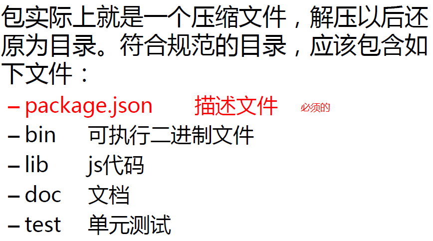
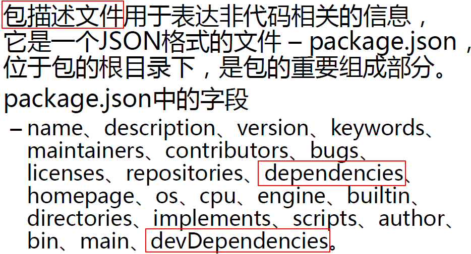

# 包机制

## package.json

 建议每个项目都有一个package.json文件。

可以通过`npm init`的方式自动初始化。

执行`npm install`，可以将package.json中的所有依赖项都安装成功。

## package.json 和 package-lock.json

npm 5 以前不会有 `package-lock.json`。

- npm 5 后，当安装包时，npm会生成或更新 `package-lock.json`。

- npm 5后，不需要添加 `--save` 参数
- `package-lock.json` 保存了node_modules中的依赖信息
- `lock` 是用来锁定第三方版本的