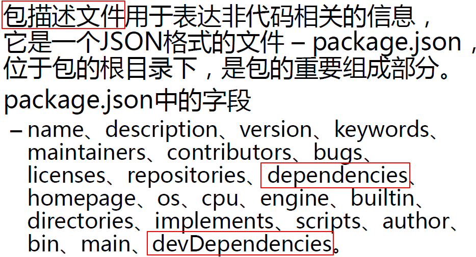

[TOC]

# Node

Node使用**事件驱动**、**非阻塞**和**异步I/O模型**等技术来提高性能。

《深入浅出Node.js》

《JavaScript高级程序设计》

《JavaScript语言精粹》

《编写可维护的JavaScript》

《ES6 入门》 阮一锋， 《深入理解 ES6》

# 模块化
在Node中，一个js文件就是一个模块。每个js文件中的js代码都是独立运行在一个函数中，而不是全局作用域，所以一个模块中的变量和函数在其他模块中无法访问。

在Node.js中为了模块管理，引入了CommonJS规范。

## 模块的引用
使用`require()`函数引入一个模块

```javascript
var 变量 = require('模块的标识');
```

## 模块的定义
- 在node中一个js文件就是一个模块。
- 默认情况下在js文件中编写的内容，都是运行在一个独立的函数中，外部的模块无法访问。

**导出变量和函数：**
1. 使用`exports`
```javascript
exports.属性 = 属性值;
exports.方法 = 函数;
```

2. 使用`module.exports`
```javascript
module.exports.属性 = 属性值;
module.exports.方法 = 函数;
module.exports = {}; // <= 重点：单独使用exports不能导出一个对象
```

## 模块的标识
模块的标识就是模块的名字或路径。

### 核心模块

对于核心模块（npm中下载的模块），直接使用模块的名字对其进行引入。

```javascript
// 核心模块
var fs = require("fs");
var express = require("express");
```
### 自定义模块

对于自定义的文件模块，需要通过文件的路径来对模块进行引入，路径可以是绝对路径，如果是相对路径必须以./或 ../开头。

```javascript
// 自定义模块
var router = require("./router");
```

### 例子

当exports多个属性和方法时，在require导入时，需要于相应的属性和方法名称相同。

```javascript
// moduleA.js
exports.x = "moduleA.js";
exports.sayHello = function () {
    console.log("moduleA.js say hello....");
}
```

第一种情况：

```javascript
// index.js 该Js文件导入其他模块
var {y, say} = require("./moduleA.js");// <= Error, 必须与moduleA.js的名称相同
var {x, sayHello} = require("./moduleA.js");
console.log(x); // moduleA.js
sayHello(); // moduleA.js say hello ....
```

第二种情况：

```javascript
// index.js 
// 使用一个变量接收modeluA.js，会自动封装为一个对象
var moduleA = require("./01.hello");
console.log(moduleA.x);
moduleA.sayHello();
```


# 模块扩展

## global 全局对象
在node中有一个全局对象 global，它的作用和网页中window类似：
在全局中创建的变量都会作为global的属性保存
在全局中创建的函数都会作为global的方法保存

## 模块内自动添加的函数
Node中每个模块运行时，会自动为其添加一个函数：
```javascript
function (exports, require, module, __filename, __dirname) {
  模块中的代码
}
```
**exports**
- 该对象用来将变量或函数暴露到外部

**require**
- 函数，用来引入外部的模块

**module**
- module代表的是当前模块本身
- exports就是module的属性
- 既可以使用 exports 导出，也可以使用module.exports导出

**__filename**

- 当前模块的完整路径
- 在模块内可以直接使用`__filename`获得模块的完整绝对路径。

**__dirname**

- 当前模块所在文件夹的完整路径
- 在模块内可以直接使用`__dirname`获得模块所在文件夹的完整绝对路径。

> 在文件操作中，使用相对路径是不可靠 的，因为在node中文件操作的路径设计为相对于执行node命令所处的路径。为了解决这个问题，只需要将相对路径转为绝对路径。
>
> `path.join(__dirname, '相对路径')`


# 包



# NPM(Node Package Manager)
NPM包管理器是CommonJS包规范的一种实践。

## 常用命令

- `npm -v` 查看npm的版本
- `npm version` 查看所有模块的版本
- `npm search 包名` 搜索包
- `npm install / i 包名` 安装包
- `npm remove / r 包名` 删除包
- `npm install 包名 --save` 安装包并添加到依赖中
- `npm install` 下载当前项目所依赖的包
- `npm install 包名 -g` 全局安装包（全局安装的包一般都是一些工具）
- `npm install 文件路径` 从本地安装
- `npm install 包名 -registry=地址` 从镜像源安装
- `npm install set registry 地址` 设置镜像源
- `npm init` 初始化模块

## 配置cnpm
参考 https://npm/taobao.org

## node搜索包的流程
node在使用模块名字来引入模块时，它会首先在当前目录的node_modules中寻找是否含有该模块
如果有则直接使用，如果没有则去上一级目录的node_modules中寻找
如果有则直接使用，如果没有则再去上一级目录寻找，直到找到为止
直到找到磁盘的根目录，如果依然没有，则报错

## package.json

 建议每个项目都有一个package.json文件。

可以通过`npm init`的方式自动初始化。

执行`npm install`，可以将package.json中的所有依赖项都安装成功。

## npm

### npm网站

www.npmjs.com

### npm命令行工具

#### 查看npm的版本

```
npm --version
npm -v
```

#### 升级npm

```
npm install --global npm
```

#### 常用命令

```shell
npm init
npm init -y    # 跳过向导，快速生成

npm install
npm install packageName
npm install packageName --save

```

## npm镜向

安装淘宝镜向

```shell
npm install --global cnpm
```

接下来即可使用cnpm

```shell
# 使用国外的npm服务器
npm install jquery
# 使用国内npm服务器
cnpm install jquery
```

如果不想安装cnpm，又想使用淘宝镜像可：

```shell
npm install jquery --register=http://register.npm.taobao.org
```

但是每一次手动加参数太麻烦，可将该选项加入配置文件：

```shell
npm config set registry http://register.npm.taobao.org

# 查看npm配置信息
npm config list
```

## package.json 和 package-lock.json

npm 5 以前不会有 package-lock.json。

- npm 5 后，当安装包时，npm会生成或更新 `package-lock.json`。

- npm 5后，不需要添加 `--save` 参数
- `package-lock.json` 保存了node_modules中的依赖信息
- `lock` 是用来锁定第三方版本的


# Node.js中的核心模块

## fs

文件系统模块

## http

网络模块

## os

系统模块

```javascript
var os = require('os');
console.log(os.hostname()); 
console.log(os.cpus());
console.log(os.totalmem());
```

## path

操作路径模块

```javascript
var path = require('path')
// 输出路径中文件的后缀名
console.log(path.extname('c:/a/b.txt'))
```


# 文件系统

## Buffer

Buffer是缓冲区。关于Buffer了解以下点即可：

- Buffer的结构和数组很像，操作的方法和数组类似
- 数组中不能存储二进制文件，而Buffer就是专门用来存储二进制数据的。
- 使用Buffer不需要引入模块，可以直接使用
- 在Buffer中存储的都是二进制数据，但是显示时都是以16进制显示
- Buffer中的一个元素就表示内存中的一个字节，范围00-ff，也就是0-255
- Buffer的内在不是通过JavaScript分配的，而是在底层通过C++申请的
- 可以直接通过Buffer来创建内存中的空间

### Buffer和字符串间的转换

- 字符串转Buffer。`Buffer.from(str, [encoding])`
- Buffer转字符串。`buf.toString([encoding], [start], [end])`

其中，支持的encoding编码：ASCII、UTF-8、UTF-16LE/UCS-2、Base64、Binary、Hex。

```javascript
var str = "Hello 你好";

var bufStr = Buffer.from(str);
var bufUTF8 = Buffer.from(str, "utf-8");

console.log(str.length);// 8
console.log(bufStr.length); // 12
console.log(bufStr); // <Buffer 48 65 6c 6c 6f 20 e4 bd a0 e5 a5 bd>

console.log(bufUTF8.length); // 12
console.log(bufUTF8); // <Buffer 48 65 6c 6c 6f 20 e4 bd a0 e5 a5 bd
```

### 创建指定大小的Buffer对象

```javascript
let buf = Buffer.alloc(1024 * 8)
```

### 写入操作

#### 向缓冲区写入字符串

```javascript
buf.write(string[,offset[,length]][,encoding])
```

#### 替换指定索引位置的数据

```javascript
buf[index]
```

#### 将指定值填入到缓冲区的指定位置

```javascript
buf.fill(value[,offset[,end]][,encoding])
```

### 读取操作

#### 将缓冲区的内容，转换为一个字符串返回

```javascript
buf.toString([encoding[,start[,end]]])
```

#### 读取缓冲区指定索引的内容

```javascript
buf[index]
```

### 其他操作

#### 复制缓冲区

```javascript
buf.copy(target[,targetStart[,sourceStart[,sourceEnd]]])
```

#### 对缓冲区切片

```javascript
buf.slice([start[,end]])
```

#### 拼接缓冲区

```javascript
Buffer.concat(list[,totalLength])
```

## 文件系统

使用文件系统，需要引入`fs`模块，fs为核心模块，直接引入即可。

### 同步文件写入

```javascript
/**
 * 打开文件
 * path：要打开文件路径
 * flags：打开文件要做的操作类型， r 只读的， w 可写的
 * mode：设置文件的操作权限，一般不传、
 * 返回一个文件的描述符
 */
fs.openSync(path, flags[, mode])
```

```javascript
/**
 * 向文件写入内容
 * fd：文件描述符
 * string: 要写入的内容
 * position：写入的位置
 * encoding：写入的编码，默认utf-8
 */
fs.writeSync(fd, string[, position[, encoding]])
```

```javascript
/**
 * 保存并关闭文件
 * fd：要关闭的文件的描述符
 */
fs.closeSync(fd);
```

#### 例子

```javascript
var fs = require("fs");
var fd = fs.openSync("test.txt", 'w');
fs.writeSync(fd, "Hello 你好");
fs.closeSync(fd);
console.log("程序向下执行...");
```


### 异步文件写入

```javascript
/**
 * 打开文件
 * path：要打开文件路径
 * flags：打开文件要做的操作类型， r 只读的， w 可写的
 * mode：设置文件的操作权限，一般不传、
 * callback: 回调函数，结果通过回调函数的参数返回，有两个参数
 *		err, 错误对象
 *		fd, 文件描述符
 */
fs.open(path, flags[, mode],callback)
```

```javascript
/**
 * 向文件写入内容
 * fd：文件描述符
 * string: 要写入的内容
 * position：写入的位置
 * encoding：写入的编码，默认utf-8
 */
fs.writeSync(fd, string[, position[, encoding]], callback)
```

```javascript
/**
 * 保存并关闭文件
 * fd：要关闭的文件的描述符
 */
fs.closeSync(fd, callback);
```

#### 例子

```javascript
var fs = require('fs');

fs.open('test2.txt', 'w', function (err, fd) {
    // 判断是否出错
    if(!err) {
        fs.write(fd, "这是异步写入的内容。", function (err) {
            if(!err) {
                console.log("写入成功。");
            }
            // 关闭文件
            fs.close(fd, function (err) {
                console.log("文件已关闭。");
            });
        });
    } else {
        console.log(err);
    }
});
```

### 简单文件写入

简单文件写入也分为同步和异步。

```javascript
/**
 * file: 文件路径
 * data：被写入的内容
 * options：对象，包含属性 encoding, mode, flag
 * callback：回调函数
 */
fs.writeFile(file, data[,options], callback);
fs.writeFileSync(file, date[,options]);
```

#### 例子

```javascript
var fs = require('fs');
fs.writeFile("./txt/test3.txt", "这是写入的内容", {flag:'w+'}, function (err) {
    if(!err) {
        console.log('写入成功。');
    } else {
        console.log('写入失败。');
    }
});
```

### 流式文件的写入

同步、异步、简单文件的写入都不适合大文件的写入，性能较差，容易导致内存溢出。

#### 创建、写入、关闭可写流

```javascript
// 创建可写流
var wf = fs.createWriteStream(file)
// 写入
wf.write(data);
// 关闭
wf.end();
```

#### 监听流

可以通过监听流的open和close事件来监听流的打开和关闭。有两种方式：`on`和`once`

- `once`绑定的是一个一次性事件，事件将会在触发一次后自动失效

```javascript
wf.on(eventStr, callback);
wf.once(eventStr, callback);
```

#### 例子

```javascript
var fs = require('fs');
// 创建写入流
var wf = fs.createWriteStream('test4.txt');
// 绑定监听
wf.on('open', function () {
    console.log('文件已打开...')
});
wf.once('close', function () {
    console.log('文件已关闭...');
});
// 写入
wf.write("hello world");
wf.write("你好，世界");
wf.write("中华人民共和国");
// 关闭流
wf.end();
```

###  文件读取

文件读取也分为：

- 同步文件读取

```javascript
fs.readSync(fd, buffer, offset, length, position)
```

- 异步文件读取

```javascript
fs.read(fd, buffer, offset, length, positon,callback)
```

- 简单文件读取

```javascript
fs.readFile(file[, options], callback)
fs.readFileSync(file[,options])
```


- 流式文件读取


```javascript
vas rs = fs.createReadStream(file)
```

#### 例子

##### 简单文件读取

```javascript
var fs = require('fs');

fs.readFile('an.jpg', function (err, data) {
    if(!err) {
        // 将data保存
        fs.writeFile("test.jpg", data, function (err) {
            if(!err) {
                console.log('复制文件成功');
            }
        })
    }
})
```

##### 可读取流：方式一

```javascript
var fs = require('fs');

// 创建一个读取流
var rs = fs.createReadStream("a.mp3");
// 创建一个写入流
var ws = fs.createWriteStream("write.mp3");

// 如果要读取一个读取流中的数据，必须要为可读流绑定一个data事件
// data事件绑定完毕，会自动读取数据
rs.on("data", function (data) {
    // 将读取到的数据写入
    ws.write(data);
});

// 监听流的开启和关闭
rs.on("open", function () {
    console.log("可读流打开了...");
});
rs.on("close", function () {
    console.log('可读流关闭了...');
});
ws.on("open", function () {
    console.log('写入流打开了...');
});
ws.on("close", function () {
    console.log('写入流关闭了...');
});
```

##### 可读取流：方式二

```javascript
var fs = require('fs');

var rs = fs.createReadStream('a.mp3');
var ws = fs.createWriteStream('write.mp3');
// pipe()可以将可读流的内容，直接输出到可写流中
rs.pipe(ws);
```

# Http

## 简单demo

1.

```javascript
// 加载http核心模块
var http = require('http');

// 创建一个server
var server = http.createServer();

// 绑定request事件，当客户端的请求过来时，就会执行
server.on('request', function(request, response) {
  console.log('客户端请求来了...'+ request.url);
  response.write('Hello');
  response.end();
});

// 实现监听
server.listen(3000, function() {
  console.log('node.js服务器开启成功，可通过http://localhost:3000访问...');
})
```

2.简写

```javascript
var http = require('http');
http.createServer(function(request, response) {
  console.log('客户端请求来了...'+ request.url);
  response.write('Hello');
  response.end();
}).listen(3000, function() {
  console.log('node.js服务器开启成功，可通过http://localhost:3000访问...');
})
```

3.

```javascript
// 加载http核心模块
var http = require('http');

// 创建一个server
var server = http.createServer();

// 绑定request事件，当客户端的请求过来时，就会执行
server.on('request', function(request, response) {
 // 设置编码格式
  response.setHeader('Content-Type', 'text/plain;charset=utf-8')
  let products = [
    {
      name: '苹果',
      price: 23
    },
    {
      name: '香蕉',
      price: 23
    },
    {
      name: '火龙果',
      price: 23
    }
  ]
  if(request.url === '/products') {
    response.end(JSON.stringify(products));
  }
});

// 实现监听
server.listen(3000, function() {
  console.log('node.js服务器开启成功，可通过http://localhost:3000访问...');
})
```

## 编码问题

```javascript
var http = require('http')

var server = http.createServer();
server.on('request', function(req, res) {
  if(req.url === '/plain') {
    res.setHeader('Content-Type', 'text/plain; charset=utf-8')
    res.end('Hello 世界');
  } else if(req.url === '/html') {
    res.setHeader('Content-Type', 'text/html; charset=utf-8')
    res.end('<h1>hello 世界</h1>')
  } 
})

server.listen(3000, function() {
  console.log('server is running on port 3000...')
})
```

## 小案例

留言板案例

代码结构：

```
public
	|-js
		|-main.js
	|-css
		|-main.js
view
	|-index.html
	|-port.html
main.js
```

```javascript
// main.js
var http = require('http')
var fs = require('fs')
var url = require('url')

http.createServer(function(req, res) {
  // 获取请求路径
  var urlObj = url.parse(req.url, true)
  var pathname = urlObj.pathname
  if (pathname === '/' || pathname === '/index') { // 获取首页
    fs.readFile('./views/index.html', function(err, data) {
      if (err) {
        res.end('index.html is not found...')
      }
      res.end(data)
    })
  } else if (pathname === '/port') { // 跳转port.html
    fs.readFile('./views/port.html', function (err, data) {
      if(err) {
        res.end('port.html is not found...')
      }
      res.end(data)
    })
  } else if (pathname === '/pinglun') { // 提交评论，并重定向至 首页
    res.statusCode = 302
    res.setHeader('Location', '/')
    res.end();

  } else if (pathname.indexOf('/public/') === 0) { // 可以访问所有静态资源，都在public文件夹下
    fs.readFile('.'+pathname, function (err, data) {
      if (err) {
        res.end('resourse is not found...')
      }
      res.end(data)
    })
  } else { // 处理其他请求
    
    res.end(pathname + 'not found...')
  }
}).listen(3000, function() {
  console.log('server is running on port 3000...')
})
```


# Express

## 入门案例

```javascript
var express = require('express')

// 创建服务
var app = express()

// 可访问静态资源
app.use('/public', express.static('./public'))

// 处理请求
app.get('/', (req, res) => {
  res.send('hello express')
})

// 开启监听
app.listen(3000, () => {
  console.log('server is running on port 3000...')
})
```

## express 获取请求数据

### get 请求

```javascript
// get 请求
req.query
```

### post 请求

需要使用`body-parser`中间件。

第一步：安装

```shell
npm install body-parser
```

第二步： 配置

```javascript
// 引入body-parser 对象
var bodyParser = require('body-parser')

// 配置 body-parser
// 配置后，req对象会多一个属性： body
// 可以直接使用 req.body 来获取表单 post 请求数据
app.use(bodyParser.urlencoded({extended: false}))
app.use(bodyParser.json())
```

第三步： 使用

```javascript
app.post('/login', (req, res) => {
  console.log(req.body)
})
```


## 集成`art-template`

第一步：安装

```shell
npm install --save art-template
npm install --save express-art-template
```

第二步：配置

```javascript
var express = require('express');
var app = express();
// 配置 .art 结尾的文件，以art-template渲染
app.engine('art', require('express-art-template'));
/*
app.set('view options', {
    debug: process.env.NODE_ENV !== 'production'
});
*/
```

第三步：使用

```javascript
app.get('/', function (req, res) {
    res.render('index.art', {
        user: {
            name: 'aui',
            tags: ['art', 'template', 'nodejs']
        }
    });
});
```

### 小例子

```javascript
var express = require('express')

// 创建服务
var app = express()
// 使用 art-template 模板引擎
app.engine('art', require('express-art-template'))

// 可访问静态资源
app.use('/public', express.static('./public'))

// 处理请求
app.get('/', (req, res) => {
  res.send('hello express is ok.')
})

app.get('/hello', (req, res) => {
  // 调用 render 函数，渲染后自动执行 send 函数
  // hello.art 文件在views文件夹下，自动在views文件夹下寻找
  res.render('hello.art', {
    user: {
      name: 'Mango'
    }
  })
})

// 开启监听
app.listen(3000, () => {
  console.log('server is running on port 3000...')
})
```

## express 处理 404

express 对于没有设定的请求路径，默认返回 Can not get  XXX

如果定制404，需要通过中间件来完成。


```javascript
// 只需要在路由之后增加以下代码
app.use(function(req, res) {
  // ...
})
```


## CRUD 案例总结


# MongoDB

## 关系型数据库和非关系型数据库

表就是关系；

所有的关系型数据库都需要 `sql` 操作

## 基本概念

- 数据库
- 集合（表）：一个数据库，有多个集合
- 文档（表记录）：一个集合，可以有多个 文档

```json
{
  // 数据库
  qq: {
    // collection 集合， 相当于表
    users: [
      // 文档，相当于MySql中的表记录
      {name: 'Mango'}.
      ...
    ]
    products: [
    
    ]
  },
taobao: {
  
},
...
}
```


## 常用操作

```shell
mongod --version # 查看版本
```

### 开启和关闭服务

```shell
# mongodb 默认使用执行 mongod 命令的所处盘符根目录下的 /data/da 作为自己的数据存储目录
# 可以提前新建 /data/db 目录
mongod

# 修改默认的存储目录
mongod --dbpath=路径

# 关闭 Ctrl + C
^c
```

### 连接数据库

```shell
# 默认连接本机服务
mongo

# 退出
exit
```

### 基本命令

```shell
# 查看所有数据库
show dbs

# 查看当前连接的数据库
db

# 新建数据库或切换至dbName数据库
use dbName

# 插入数据
db.students.insertOne({
  "name": "Jack"
})

# 显示所有集合
show collections

# 查找
db.students.find()
```


## Node中如何操作MongoDB

### 使用官方的`mongodb`包

可查看github上的mongodb包的使用方法


### 使用第三方`mongoose`

基于`mongodb`做了封装。

www.mongoosejs.com

#### quick start 

1.

```javascript
var mongoose = require('mongoose')

// 连接数据库
mongoose.connect('mongodb://localhost/mango', {  })

mongoose.Promise = global.Promise


// 创建模型
var Cat = mongoose.model('Cat', { name: String })


// 实例化一个Cat
var kitty = new Cat({name: 'Kitty'})

// 持久化保存 kitty 实例 
kitty.save((err) => {
  if (err) {
    console.log(err)
  } else {
    console.log('success!')
  }
})
```

2.

```javascript
var mongoose = require('mongoose')
var Schema = mongoose.Schema
// 连接 mango 数据库
mongoose.connect('mongodb://localhost/mango')

// 设计表结构
var blogSchema = new Schema({
  title:  String,
  author: String,
  body:   String,
  comments: [{ body: String, date: Date }],
  date: { type: Date, default: Date.now },
  hidden: Boolean,
  meta: {
    votes: Number,
    favs:  Number
  }
});

var userSchema = new Schema({
  username: {
    type: String, 
    required: true
  },
  password: {
    type: String,
    required: true
  },
  email: {
    type: String
  }
})

// 将表结构发布为模型
/**
 * first param: 传入一个大写名词单数字符串，
 *              mongoose会自动转为小写复数的表名称
 *              例如：User 变为 users
 * second param：表结构
 * return value：模型构造函数
 */
var User = mongoose.model('User', userSchema)

// 创建对象
var user = new User({
  username: 'mango',
  password: '123',
  email: 'mango@163.com'
})

// ret 返回值， 返回保存后的对象
user.save((err, ret) => {
  if (err) {
    return console.log('保存失败')
  }
  console.log('保存成功')
  console.log(ret)
})
```

#### 增加数据

```javascript
// ret 返回值， 返回保存后的对象
user.save((err, ret) => {
  if (err) {
    return console.log('保存失败')
  }
  console.log('保存成功')
  console.log(ret)
})
```

#### 查询数据

##### 1. 查询所有

```javascript
// 查询所有
// User 为模板类
User.find((err, ret) => {
  if (err) {
    return console.log('查询失败')
  }
  console.log(ret)
})
```

##### 2. 按条件查询所有

```javascript
// 查询 username 为 mango 的所有数据
User.find({
  username: 'mango'
}, (err, ret) => {
  if (err) {
    return console.log('find mango failed..')
  }
  console.log(ret)
})
```

##### 3. 按条件查询一个

```javascript
// 查询第一个 username 为 mango 的数据
User.findOne({
  username: 'mango'
}, (err, ret) => {
  if (err) {
    return console.log('find mango failed..')
  }
  console.log(ret)
})
```

#### 更新数据

```javascript
// 更新
// ret 返回旧对象
// 第一个参数为id，第二个参数为 要修改的项，第三个参数为 callback 回调函数
User.findByIdAndUpdate('5d144ecd02f84c2908bf70e2', {
  username: 'MangoLee',
  password: 1234567
}, (err, ret) => {
  if (err) {
    return console.log(err)
  }
  console.log('更新成功')
  console.log(ret)
})

// 根据条件更新所有
User.update(conditions, [options], [callback])

// 根据条件更新一个
User.findOneAndUpdate(conditions, [update], [options], [callback])
```

#### 删除数据

```javascript
// 删除所有符合条件的数据
// ret 返回的数据为 {n:3, ok:1, deletedCount:3} 代表删除的数据条数
User.remove({
  username: 'mango'
}, (err, ret) => {
  if (err) {
    throw err
  }
  console.log('删除成功')
  console.log(ret)
})

// 根据条件删除一个
User.findOneAndRemove(conditons, [options], [callback])

// 根据 id 删除一个
User.findByIdAndRemove(id, [options], [callback])
```


# Promise

Promise 本身不是异步，Promise内的任务是异步。可以把Promise 作为一个异步容器。

## quick start

```javascript
var fs = require('fs')
// 建立一个 Promise 对象
var promise = new Promise(function (resolve, reject) {
  fs.readFile('./data/a.txt', 'utf8', (err, data) => {
    if (err) {
      // failed 将 promise的 pending 状态改为 reject
      reject(err)
    } else {
      // success 将 promise的 Pending 状态改为 resolve
      resolve(data)
    }
  })
})

// then 方法的
// 第一个函数接收的 data 即为 resolve(data) 中的 data
// 第一个函数对应 function(resolve, reject) 中的 resolve
// 第二个函数接收的 err 即为 reject(err) 中的 err
promise.then(function (data) {
  console.log(data)
}, function (err) {
  console.log(err)
})
```

## 异步嵌套

- then 的第一个函数返回值如果为 Promise 实例，则 其下方的 then 的第一个函数 为 返回值的 resolve()函数
- then 的第一个函数返回值如果不为 Promise 实例，则 其下方的 then 的第一个函数的参数 data 为返回值。

```javascript
const fs = require('fs')

function promiseReadFile(filepath) {
  let promise = new Promise((resolve, reject) => {
    fs.readFile(filepath, 'utf8', (err, data) => {
      if (err) {
        reject(err)
      } else {
        resolve(data)
      }
    })
  })
  return promise
}

var promiseA = promiseReadFile('./data/a.txt')
var promiseB = promiseReadFile('./data/b.txt')
var promiseC = promiseReadFile('./data/c.txt')

// then 的第一个函数返回值如果为 Promise 实例，
// 则 其下方的 then 的第一个函数 为 返回值的 resolve()函数
// then 的第一个函数返回值如果不为 Promise 实例，
// 则 其下方的 then 的第一个函数的参数 data 为返回值。
promiseA
  .then(function (data) {
    console.log(data)
    return promiseB
  })
  .then(function (data) {
    console.log(data)
    return promiseC
  })
  .then(function (data) {
    console.log(data)
  })
```

## Promise 的应用场景

### 封装原始Ajax对象

类似jQuery的用法。

```javascript
function get (url) {
  return new Promise((resolve, reject) => {
    var ajax = new XMLHttpRequest()
    ajax.onload = function () {
      resolve(ajax.responseText)
    }
    ajax.onerror = function (err) {
      reject(err)
    }
    ajax.open('get', url, true)
    ajax.send()
  })
}

get('http://...')
  .then(function (data) {
    // ... 一些操作
    return get('http://...vv')
  })
  .then(function (data) {
    // ...
  })
```


### mongoose所有操作都支持Promise

```javascript
// 原始
User.find((err, ret) => {
  if (err) {
    return console.log('查询失败')
  }
  console.log(ret)
})

// 使用Promise形式
User.find().then(function(data) {
  //
})
```

```javascript
/**
 * 场景： 用户注册
 * 判断用户是否存在
 * 如果存在，结束注册
 * 如果不存在，注册（保存一条用户记录）
 */
User.findOne({
  username: 'admin'
}).then(function (user) {
  if (user){
    // 用户已存在
  } else {
    // 用户不存在
    return new User({
      username: 'admin',
      password: '123'
    }).save()
  }
}).then(function (ret) {
  // ...
})
```


# path 文件路径操作模块

<https://nodejs.org/dist/latest-v10.x/docs/api/path.html>

`path.basename(path)`

获取一个路径中的文件名，默认带扩展名


`path.dirname(path)`

获取一个路径中的目录部分


`path.extname(path)`

获取一个路径中的扩展名


`path.isAbsolute(path)`

判断一个路径是否是绝对路径


`path.join([...paths])`

路径拼接


`path.parse(path)` 

将一个路径转为一个对象，对象属性包括：

- root 根目录
- dir 文件目录
- name 文件名
- ext 扩展名
- base 文件名. 扩展名


# 其他

## 自动重启

使用第三方工具`nodemon`解决重启服务器的问题。

`nodemon`是一个基于Node.js开发的第三方命令行工具。

第一步，先全局安装`nodemon`

```shell
npm install nodemon --global
```

第二步，使用`nodemon xxx.js`代替`node xxx.js`

```shell
nodemon xxx.js
```

## JavaScript 的单线程和事件循环

待查


## 浏览器使用模块化

- require.js
- sea.js

可自行百度使用。


## 数组中`find()`和`findIndex()`方法

`find(fn)` 接收一个方法 作为参数，方法内部返回一个条件，find会遍历所有的元素，如果有符合条件的元素会返回该元素，如果没有则返回`undefined`。

`findIndex(fn)`返回的是下标，如果没有符合条件的元素，则返回-1.

```javascript
var persons = [
  {id: 1, name: 'John'},
  {id: 1, name: 'John'},
  {id: 1, name: 'John'}
]

persons.find((item, index) => {
  return item.id === 2
})
```


## http-server

简易开启一个 http 服务。


## json-server

简易开启一个Json服务，可自动识别 json 文件中的对象。

开启一个json-server服务模拟ajax请求。

```shell
json-server --watch data.json
```

新建一个 html 文件

```html
<!DOCTYPE html>
<html lang="en">
<head>
  <meta charset="UTF-8">
  <meta name="viewport" content="width=device-width, initial-scale=1.0">
  <meta http-equiv="X-UA-Compatible" content="ie=edge">
  <script src="./node_modules/jquery/dist/jquery.js"></script>
  <title>Document</title>
</head>
<body>

  <script>
    $.ajax({
      type: 'GET',
      dataType: 'JSON',
      url: 'http://localhost:3000/users',
      success: function (data) {
        console.log(data)
      }
    })
  </script>
  
</body>
</html>
```


# 多人社区案例


